# SENTINEL - Architecture Documentation

## Table of Contents
1. [System Overview](#system-overview)
2. [High-Level Architecture](#high-level-architecture)
3. [Detection Pipeline](#detection-pipeline)
4. [Data Flow](#data-flow)
5. [Component Details](#component-details)
6. [Data Models](#data-models)
7. [Deployment Architecture](#deployment-architecture)
8. [Security Model](#security-model)

---

## System Overview

**SENTINEL** is a lightweight LLM security middleware that acts as a transparent proxy between users and Large Language Models. It provides real-time threat detection, policy enforcement, and output sanitization without requiring any changes to client applications.

### Key Features
- **Multi-Layer Detection** - Rule-based, GLM triage, and Qwen deep analysis
- **Explainability** - Structured threat metadata on every request
- **User-Aware Defense** - Adaptive security based on trust profiles
- **Firewall Modes** - Strict/Balanced/Open operational modes
- **Output Scrubbing** - PII detection and removal via Presidio + Nemotron
- **Real-Time Dashboard** - Live threat monitoring with SSE feed

---

## High-Level Architecture

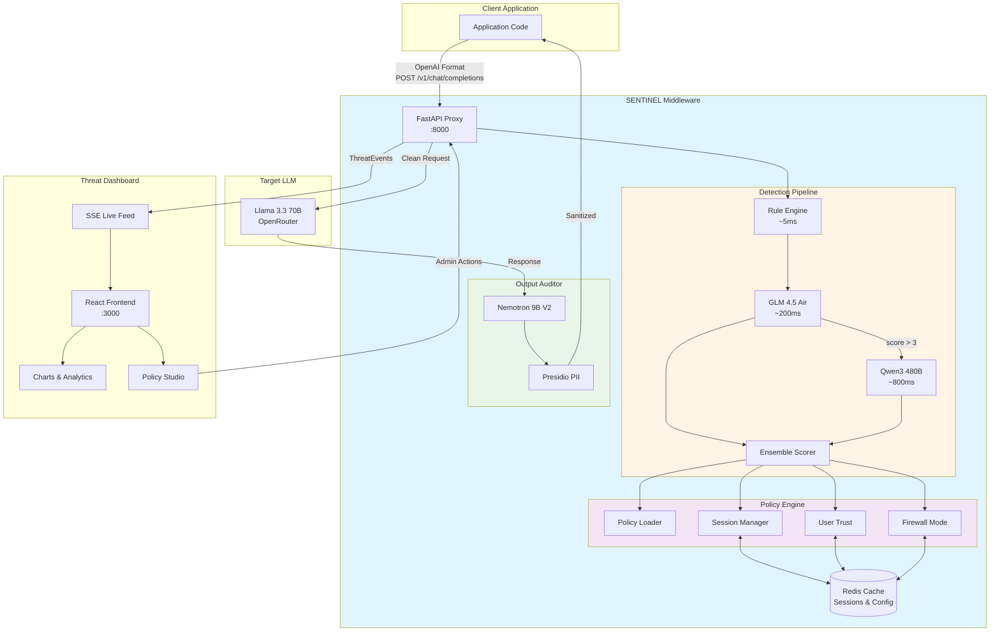

---

## Detection Pipeline

The detection pipeline processes every incoming request through up to 3 layers, combining scores with configurable weights.

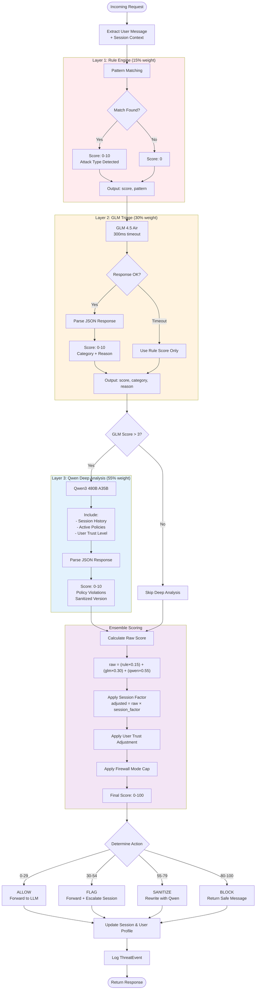

---

## Data Flow

### Request Flow (Clean Path)

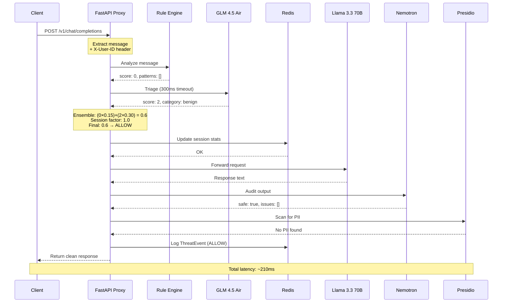

### Request Flow (Attack Blocked)

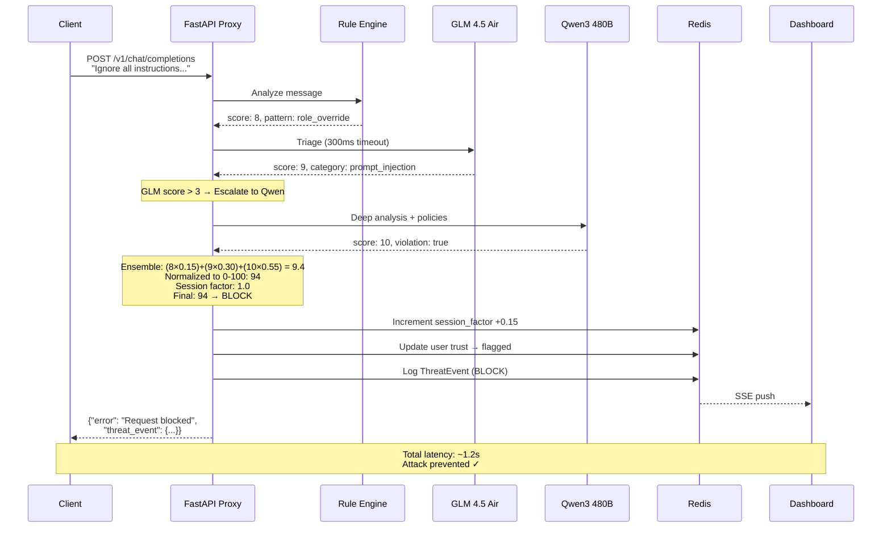

---

## Component Details

### 1. Detection Pipeline Components

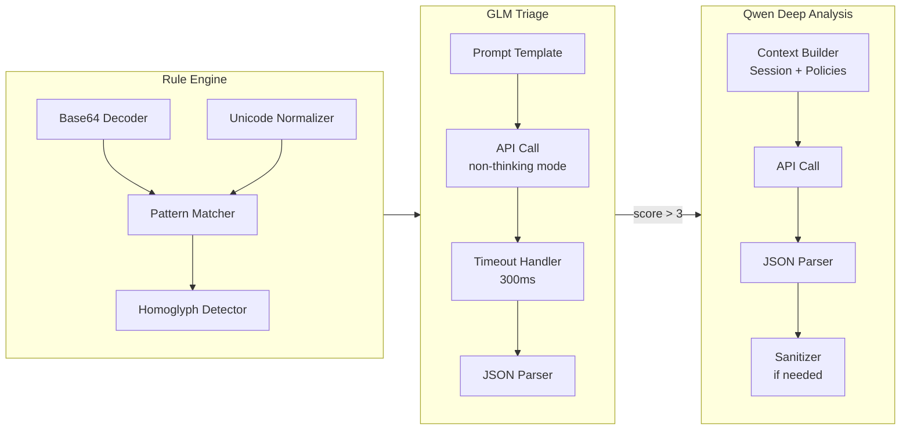

### 2. Policy Engine

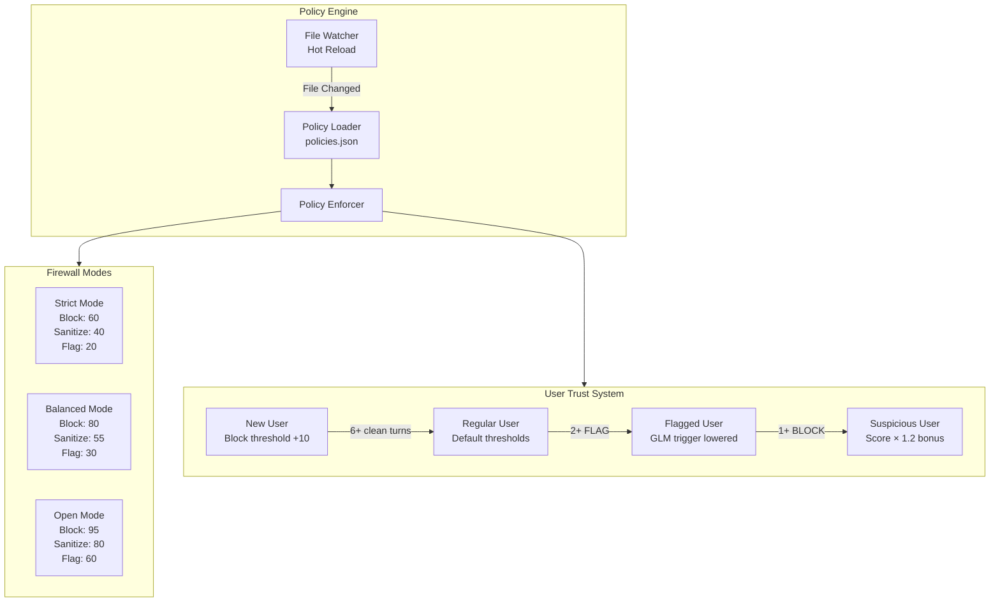

### 3. Session Management

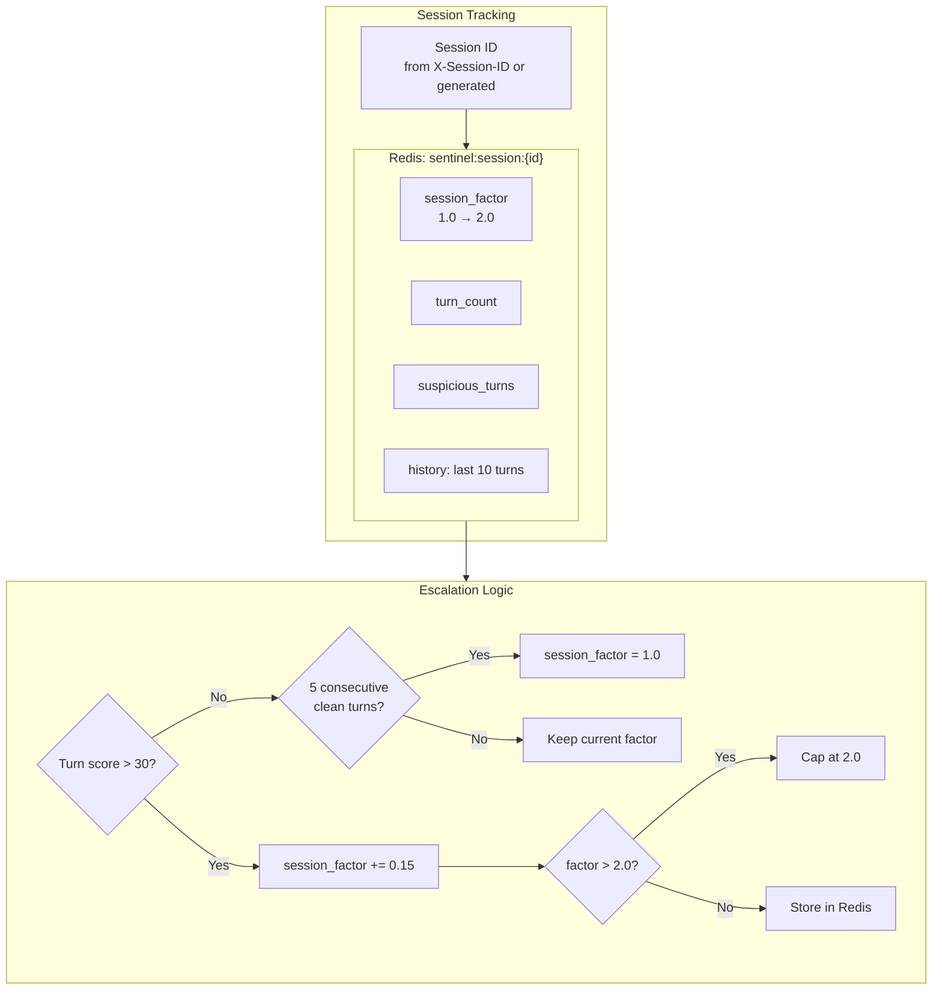

---

## Data Models

### ThreatEvent Schema

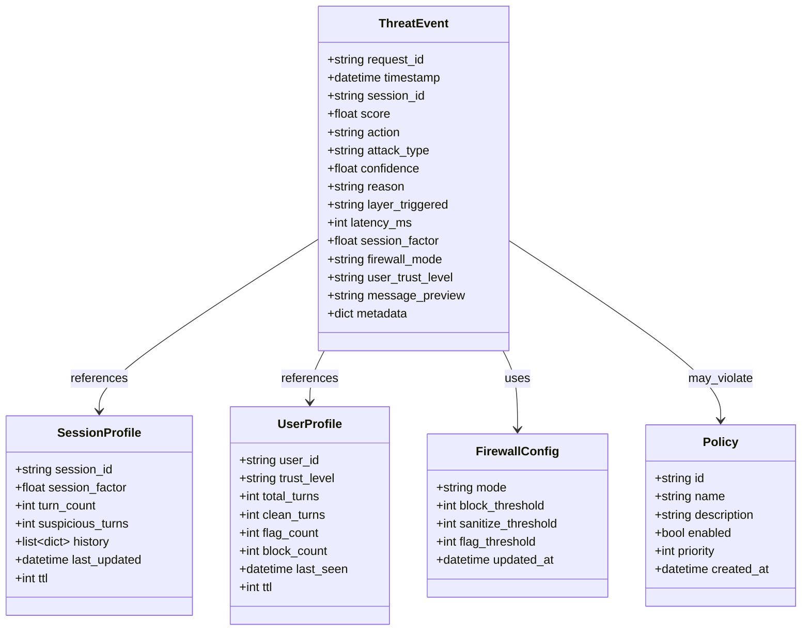

### API Request/Response Models

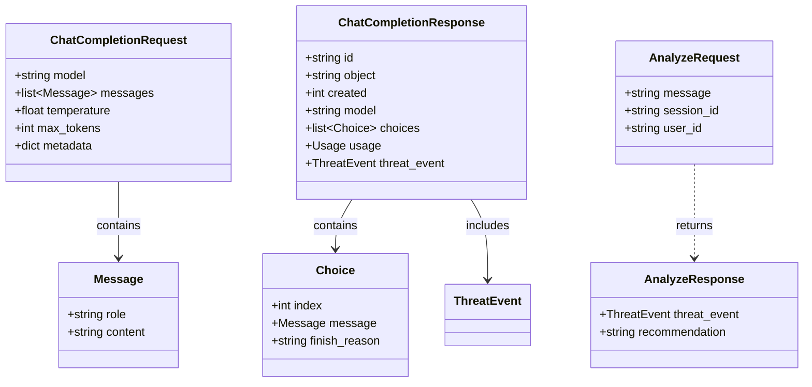

---

## Deployment Architecture

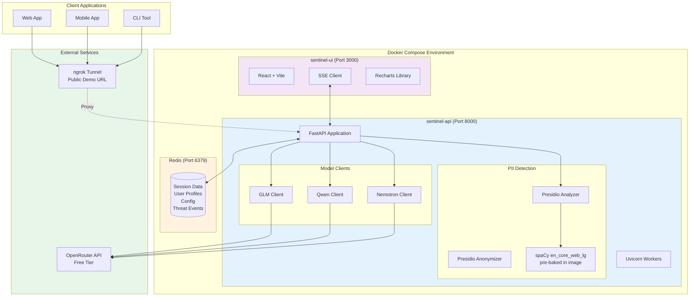

### Container Architecture

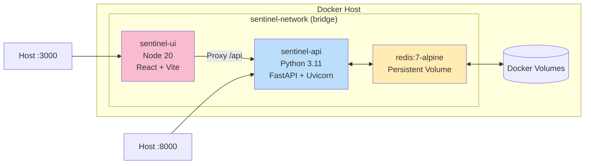

---

## Security Model

### Authentication & Authorization

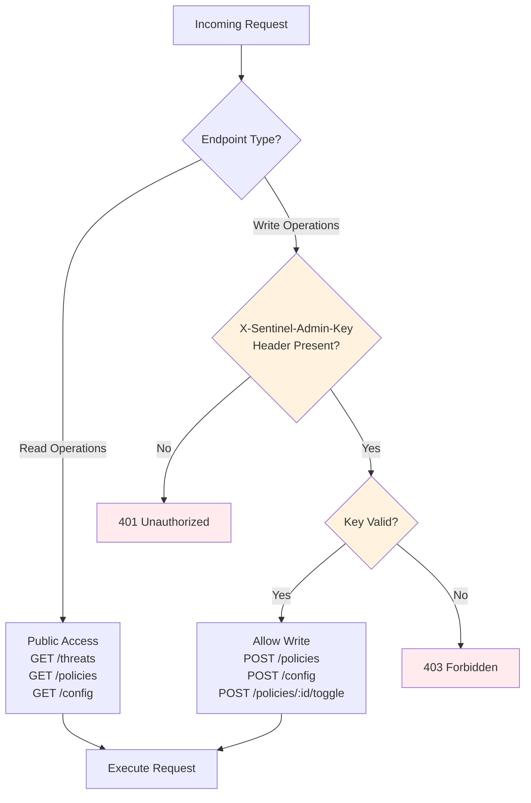

### Threat Detection Layers

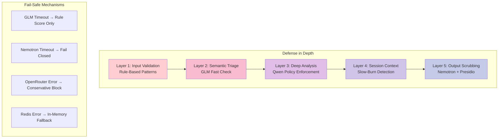

### PII Protection Flow

```mermaid
flowchart LR
    LLM_RESPONSE[LLM Response Text] --> NEMOTRON_SCAN[Nemotron Analysis]
    
    NEMOTRON_SCAN --> PRESIDIO_DETECT[Presidio Entity Detection]
    
    PRESIDIO_DETECT --> ENTITIES{Entities Found?}
    
    ENTITIES -->|Yes| CLASSIFY[Classify:<br/>EMAIL, PHONE, SSN,<br/>CREDIT_CARD, etc.]
    ENTITIES -->|No| CLEAN[Return Original]
    
    CLASSIFY --> REDACT[Presidio Anonymizer<br/>Replace with [REDACTED]]
    
    REDACT --> AUDIT_LOG[Log Original + Redacted<br/>in Audit Trail]
    
    AUDIT_LOG --> RETURN[Return Redacted Response]
    
    style PRESIDIO_DETECT fill:#e8f5e9
    style REDACT fill:#fff3e0
    style AUDIT_LOG fill:#e3f2fd
```

---

## Performance Characteristics

### Latency Breakdown

```mermaid
gantt
    title Request Latency (Benign Path - Clean Request)
    dateFormat X
    axisFormat %Lms
    
    section Input Analysis
    Rule Engine :0, 5
    GLM Triage :5, 205
    
    section Processing
    Ensemble Scoring :205, 210
    
    section LLM Call
    Llama 3.3 70B :210, 1210
    
    section Output Audit
    Nemotron Check :1210, 1710
    Presidio Scan :1710, 1740
    
    section Response
    Format & Return :1740, 1750
```

```mermaid
gantt
    title Request Latency (Attack Path - Deep Analysis)
    dateFormat X
    axisFormat %Lms
    
    section Input Analysis
    Rule Engine :0, 5
    GLM Triage :5, 205
    Qwen Deep Analysis :205, 1005
    
    section Processing
    Ensemble Scoring :1005, 1010
    Session Update :1010, 1025
    
    section Response
    Block Response :1025, 1030
```

### Scalability Targets

| Metric | Target | Notes |
|--------|--------|-------|
| Throughput | 100 req/s | Single instance |
| P50 Latency (benign) | < 300ms | Rule + GLM only |
| P95 Latency (benign) | < 500ms | Including outliers |
| P50 Latency (escalated) | < 1.5s | Full pipeline |
| False Positive Rate | < 2% | Measured on benign corpus |
| False Negative Rate | < 5% | Measured on attack corpus |
| Redis Hit Rate | > 95% | Session cache efficiency |

---

## API Endpoint Map

```mermaid
graph LR
    subgraph Proxy["Proxy Endpoints"]
        P1[POST /v1/chat/completions<br/>Main proxy - OpenAI compatible]
        P2[POST /analyze<br/>Analyze without forwarding]
    end
    
    subgraph Threats["Threat Management"]
        T1[GET /threats<br/>Last 100 events]
        T2[GET /threats/live<br/>SSE stream]
        T3[GET /session/:id<br/>Session history]
    end
    
    subgraph Policies["Policy Management"]
        PO1[GET /policies<br/>List all policies]
        PO2[POST /policies<br/>[AUTH] Add policy]
        PO3[POST /policies/:id/toggle<br/>[AUTH] Enable/disable]
    end
    
    subgraph Config["Configuration"]
        C1[GET /config<br/>Current firewall mode]
        C2[POST /config<br/>[AUTH] Set firewall mode]
    end
    
    subgraph System["System"]
        S1[GET /health<br/>Health check]
    end
    
    style P1 fill:#e3f2fd
    style T2 fill:#fff3e0
    style PO2 fill:#ffebee
    style PO3 fill:#ffebee
    style C2 fill:#ffebee
```

[AUTH REQUIRED] = Requires `X-Sentinel-Admin-Key` header

---

## Technology Stack Deep Dive

### Backend Stack

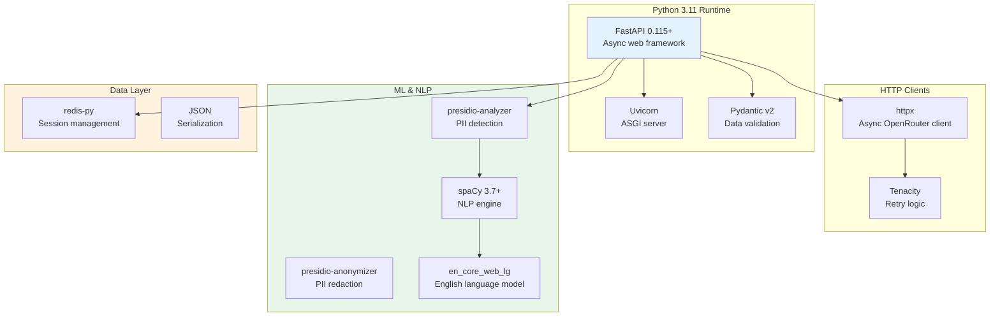

### Frontend Stack

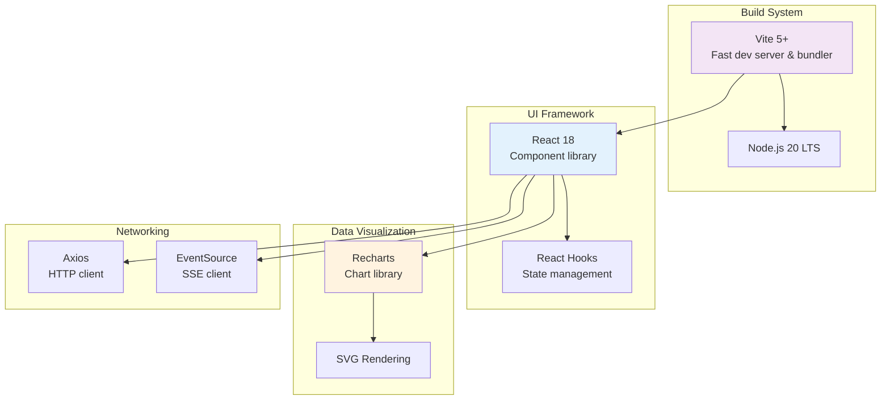

---

## Deployment Checklist

### Pre-Deployment

- [ ] Environment variables configured in `.env`
- [ ] `SENTINEL_ADMIN_KEY` set to strong random value
- [ ] OpenRouter API key valid and funded
- [ ] Docker and Docker Compose installed
- [ ] Ports 8000, 3000, 6379 available

### Build & Test

- [ ] `docker compose build` completes successfully
- [ ] spaCy model pre-baked in image (no runtime download)
- [ ] Unit tests pass
- [ ] Integration tests pass
- [ ] E2E attack scenarios validated

### Runtime

- [ ] `docker compose up` starts all 3 services
- [ ] Health check returns 200: `curl http://localhost:8000/health`
- [ ] Redis connection confirmed
- [ ] Frontend loads at `http://localhost:3000`
- [ ] SSE stream connects successfully

### Demo Preparation

- [ ] Run `python seed_demo.py` to pre-seed session data
- [ ] Start ngrok tunnel: `ngrok http 8000`
- [ ] Update React `.env` with ngrok URL
- [ ] Test all 6 demo attack scenarios
- [ ] Verify dashboard shows threat events in real-time
- [ ] Practice 3-minute demo script 3 times

---

## Monitoring & Observability

### Metrics to Track

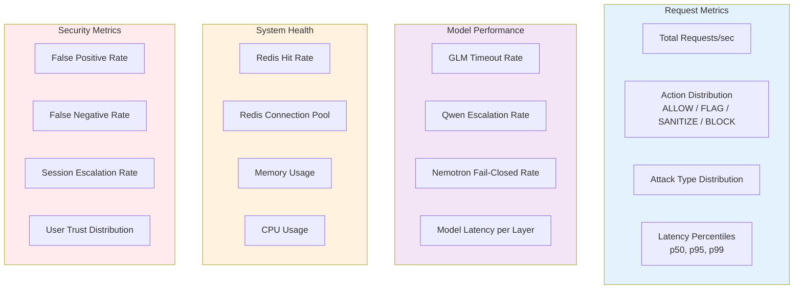

---

## Future Enhancements

### Planned Features

1. **Advanced Policy DSL** - JSON-based policy definitions with boolean logic
2. **Multi-Tenant Support** - Isolated policies and configs per organization
3. **Custom Model Integration** - Support for self-hosted models
4. **Webhook Notifications** - Real-time alerts for high-severity threats
5. **A/B Testing Framework** - Test policy changes before production
6. **Behavioral Analytics** - User behavior profiling beyond trust scores
7. **Compliance Reporting** - Auto-generated SOC 2 / GDPR reports
8. **Rate Limiting** - Per-user and per-IP rate limits

### Architecture Evolution

```mermaid
graph TB
    subgraph Current["Current Architecture"]
        C1[Single Instance<br/>Docker Compose]
        C2[In-Process Detection]
        C3[Redis Cache]
    end
    
    subgraph Future["Future Architecture"]
        F1[Kubernetes Deployment<br/>Auto-scaling]
        F2[Distributed Queue<br/>Kafka/RabbitMQ]
        F3[Microservices<br/>Detection / Policy / Audit]
        F4[PostgreSQL<br/>Long-term storage]
        F5[Prometheus + Grafana<br/>Monitoring]
    end
    
    Current -.->|Migration Path| Future
    
    style Current fill:#ffecb3
    style Future fill:#c8e6c9
```

---

## Glossary

| Term | Definition |
|------|------------|
| **Ensemble Scoring** | Weighted combination of multiple detection layer scores |
| **Fail-Closed** | Security policy where errors default to blocking access |
| **Firewall Mode** | Operational mode determining threat score thresholds |
| **GLM** | General Language Model (GLM 4.5 Air - fast triage model) |
| **Homoglyph** | Visually similar characters from different Unicode blocks |
| **Layer Triggered** | The detection layer that contributed most to the final decision |
| **Nemotron** | NVIDIA's LLM for content safety and PII detection |
| **PII** | Personally Identifiable Information |
| **Presidio** | Microsoft's open-source PII detection framework |
| **Qwen** | Alibaba's large language model for deep analysis |
| **Session Factor** | Multiplier that increases with suspicious activity |
| **Slow-Burn Attack** | Multi-turn attack that gradually escalates |
| **SSE** | Server-Sent Events (one-way real-time updates) |
| **ThreatEvent** | Structured log of a security decision |
| **User Trust Level** | Classification of user based on historical behavior |
| **Victim Model** | The target LLM being protected (Llama 3.3 70B) |

---

## References

- [FastAPI Documentation](https://fastapi.tiangolo.com/)
- [OpenRouter API](https://openrouter.ai/docs)
- [Presidio Documentation](https://microsoft.github.io/presidio/)
- [spaCy Documentation](https://spacy.io/)
- [Redis Documentation](https://redis.io/docs/)
- [OWASP LLM Top 10](https://owasp.org/www-project-top-10-for-large-language-model-applications/)

---

**Document Version:** 2.0  
**Last Updated:** 2026-04-03  
**Status:** Implementation Ready
